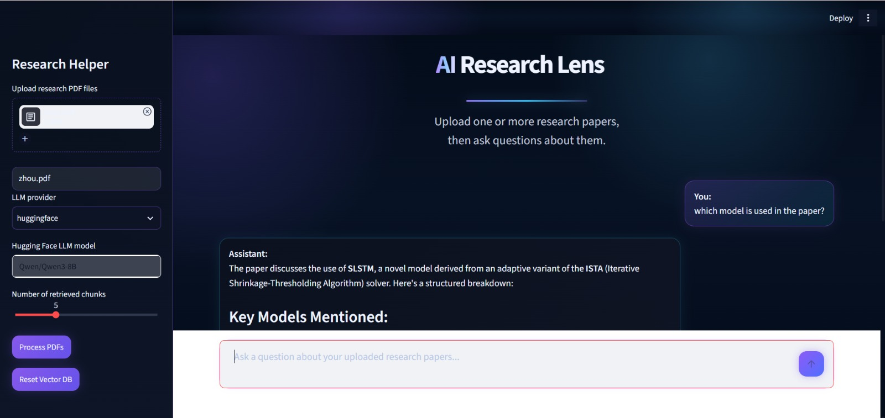
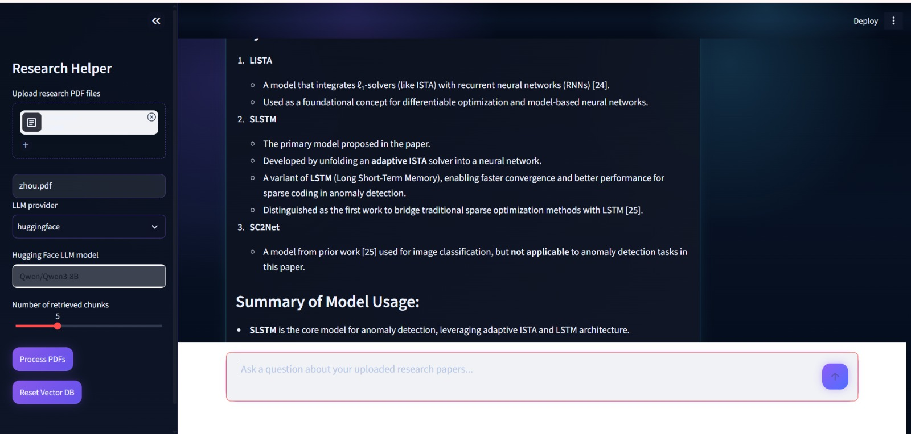
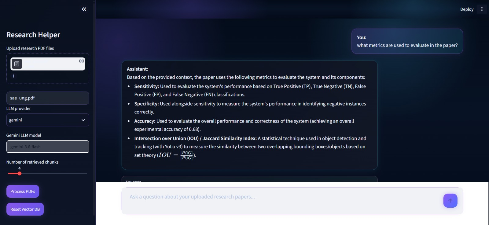

# 🔬 ResearchLens — AI Research Paper Assistant

<p align="center">
  
</p>

<p align="center">
  <strong>Read less. Understand more.</strong>
</p>

<p align="center">
  AI-powered assistant for asking questions and extracting insights from research papers.
</p>

<p align="center">
  
  
  
  
  
  
  
</p>

---

## 📌 Overview

**ResearchLens** is an AI-powered research assistant that allows you to upload multiple research papers and ask questions about them using natural language.

It uses **Retrieval-Augmented Generation (RAG)** to find relevant information from your documents before generating an answer, with source citations for easier verification.

### ✨ Features

- 📄 Upload multiple research paper PDFs
- 🧠 RAG-based question answering
- 🔍 Hybrid search using **Dense + BM25**
- ⚡ Reciprocal Rank Fusion (RRF)
- 📚 Source citations with page numbers
- 🤖 Gemini, Ollama & Hugging Face support
- 🧩 One-column and two-column PDF support
- 🖥️ Clean and interactive Streamlit UI

---

## 🏗️ Architecture

```text
PDF Upload
    ↓
PDF Text Extraction
    ↓
Section-Aware Chunking
    ↓
Dense + BM25 Indexing
    ↓
Qdrant Vector Database
    ↓
Hybrid Retrieval + RRF
    ↓
LLM
    ↓
Answer + Source Citations


## 🛠️ Tech Stack
Technology	   Purpose
Python	      Core application
Streamlit	   Web interface
LangChain	   RAG pipeline
Qdrant	      Vector database
FastEmbed	   Embeddings
BM25	         Keyword retrieval
Gemini	      LLM
Ollama	      Local LLM
Hugging Face	LLM support
Docker	      Qdrant deployment


## Project Structure

.
├── app.py
├── requirements.txt
├── docker-compose.yaml
├── html_template.py
├── assets/
├── data/
├── qdrant_data/
├── notebooks/
└── src/
    ├── chunk_splitter.py
    ├── embeddings.py
    ├── llm.py
    ├── pdf_loader.py
    ├── rag.py
    └── vector_db.py


## Limitations

- Answer quality depends on PDF text extraction quality.
- The system only answers from uploaded documents and does not use external knowledge.
- Large PDFs or many uploaded files can increase processing time.
- Scanned PDFs may require OCR before they can be processed accurately.


## Demo

<p align="center">
  
  
  
</p>

